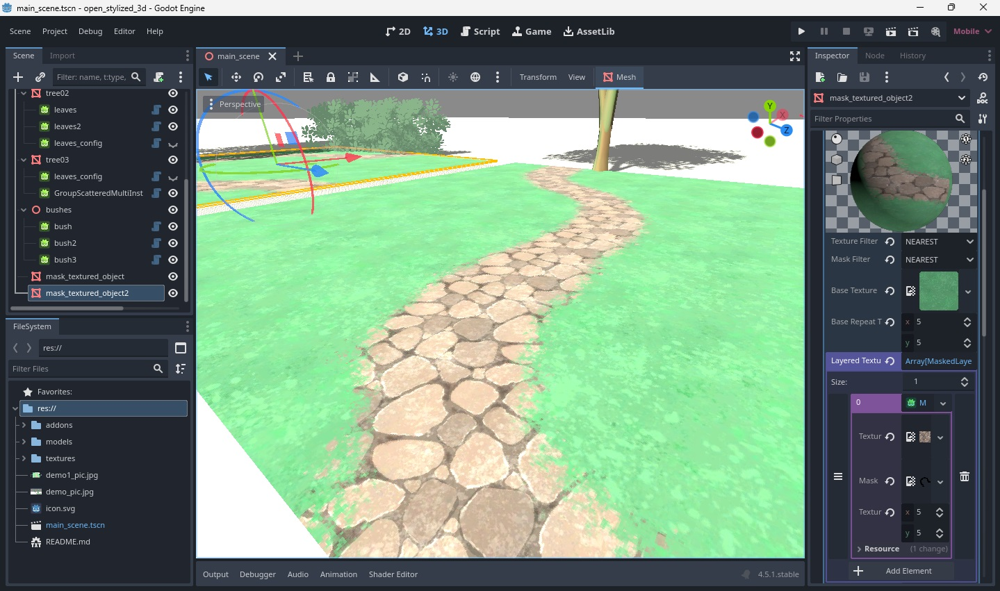

# OpenStylized3D-Godot-Addon-
Lets Create Stylized Trees and Grass in Godot!
**v:1.3.1**

Its easy to use, Everything can be configured inside the inspector

# Contents

# Features
**Added Resources**
* MaskedLayerMaterial3D_OPEN_STYLIZED - custom object material with masks and layers (DO NOT USE TOO MANY LAYERS)
* MaskedLayerTexture2D_OPEN_STYLIZED - pair of layer texture and mask

**Added Nodes**
* WaveScatteredMultiInstance3D_OPEN_STYLIZED - used to render grass and leaves using randomizer to scatter the objects
* GroupScatteredMultiInstance3D_OPEN_STYLIZED - group of scattered objects (NOT MULTI INSTANCE, JUST USE AS LESS AMOUNT OF OBJECT AS POSSIBLE)

**Shaders**

* wave.gdshader - efficient bilboarding and wave animation functionality.

**Assets Demo Files** (free to use)

* tree01.obj
* tree02.obj
* tree03.obj
* grass01.png
* leaves01.png
* leaves02.png
* leaves03.png
* leaves04.png
* tree01.png
* tree02.jpg
* floor01_base.jpg
* floor01_dirt.jpg
* floor01_mask.png
* floor02_mask.png

