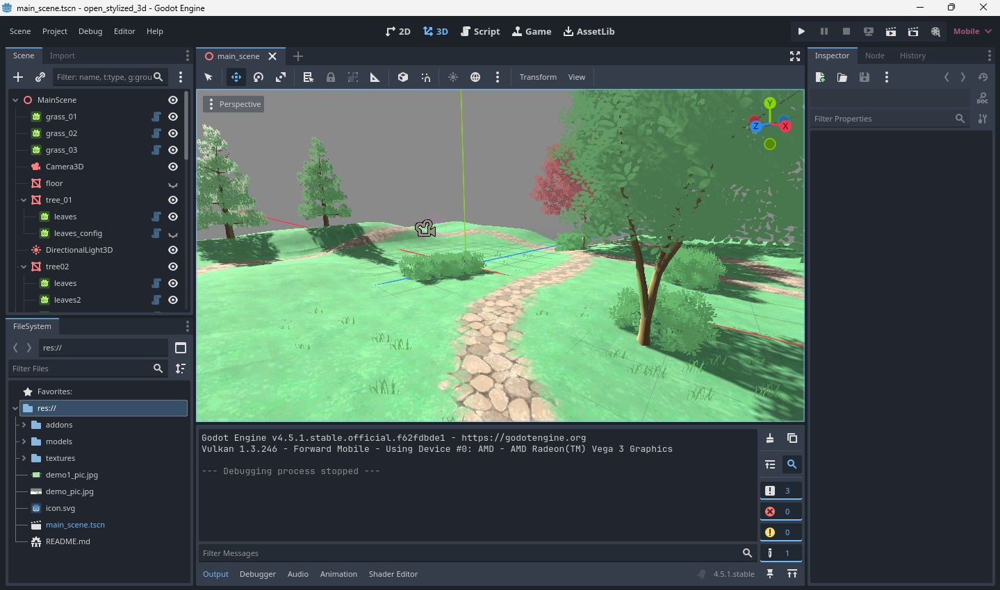

# OpenStylized3D-Godot-Addon-
Lets Create Stylized tree and grass in Godot!
**v:1.2.0**
# Contents

**Added Nodes**
* WaveScatteredMultiInstance3D_OPEN_STYLIZED - used to render grass and leaves using randomizer to scatter the objects
* GroupScatteredMultiInstance3D_OPEN_STYLIZED - group of scattered object 

**Shaders**

* wave.gdshader - efficient bilboarding and wave animation functionality.

**Assets Demo**

* tree01.obj
* tree02.obj
* grass01.png
* leaves01.png
* leaves02.png
* tree01.png
